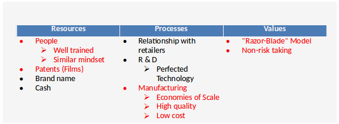

# Kodak's Capabilities (RPV Framework)
## Resource
- People
    + Well trained
    + Similar mindset
- Patents (Films)
- Brand name
- Cash

## Process
- Relationship with retailers
- R & D
    + Perfected technology
- Manufacturing
    + Economies of scale
    + High quality
    + Low cost

## Values
- "Razor-Blade" Model (Patents for every small thing)
- Non-risk taking

However, things in red are not valid in digital world:

# What Could Kodak Have Done Differently
- Kodak could have benefited from having an independent subsidiary in charge of digital technology, as suggested by the disruptive innovation theory. 
- Important that subsidiary does not compete with traditional photography for resources
- Would have allowed Kodak to match the Resources, Processes and Values needed for the digital technology, and overcome cognitive and action inertia.

