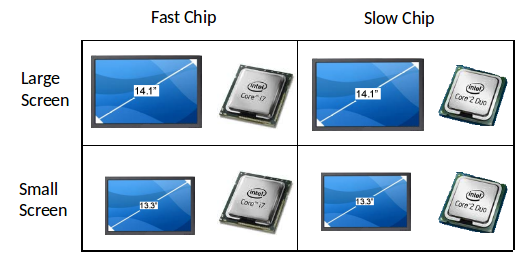
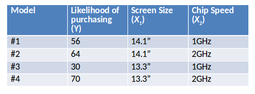
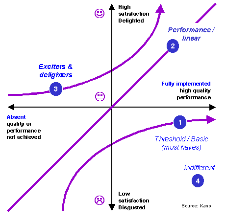
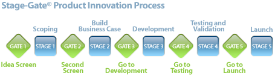
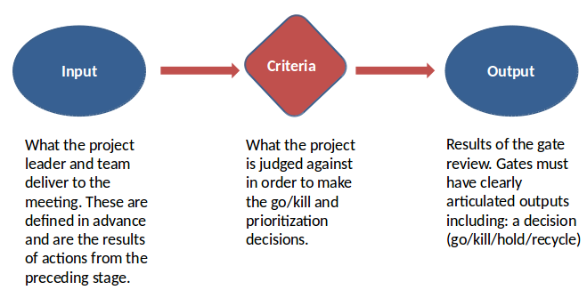
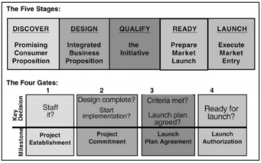

# Case Example: Qualcomm
The CEO sparked new product development
by starting a program called “Venture Fest”

## Main Idea Behind Venture Fest
- Experimentation to try out new ideas to test validity
- Ideas should have some tie with existing business unit.

## Competition flow
- Idea Generation & Selection: Employees submitted ideas for products which were reduced to 20 best ideas based on peer-review
- Boot Camp: Employees whose ideas were selected participated in a three
month boot camp where they tested their ideas with customers and developed 
prototypes
- Implementation: Employees pitched their ideas to senior executives for funding and a business unit had to adopt the new idea

## Result
- Venture Fest was a success with ideas submitted increasing from ~80 to > 500 in five years
- Many potential breakthrough ideas were identified

# Case Example: AT&T
## Social Innovation
- Participants source, vote on and discuss ideas
- The platform is open 24/7/365, so innovation can "follow the sun"

## Prototype
- After a brief incubation period, top idea founders build proposals and develop business cases, before pitching to the higher-ups
- AT & T seniors act as venture capitalists
- Successful founders leave ith funding to develop their ideas

## Production
- Successful ideas are eligible for a second incubation period in which the ideas are moved from prototype to production, and toward deployment to customers.
- TIP champions help idea founders allocate budget and move ideas throught the appropriate business unit for launch.

## Commercialization
- Implemented by an AT&T business unit
- Spun off into an external company
- Sold to a third party

# Case Example: Google
Google provides a lot of tools to its employees for experimentation called "Design kitchen".

The "Design kitchen" is stocked with all kinds for products for rapid prototyping.

# Techniques used for selecting product features
- Conjoint analysis
- Kano method

## Conjoint Analysis
Main question: what factors are important in consumer's buying decision?ng decision?

### Example
If you are a potential buyer of a notebook computer, how important are these product attributes - screen size and chip speed – to your purchase decision? What value do you put to a larger screen size and fast chip?

Start of with a simple example where there are only two product attributes that are important for making purchase decision:
- Screen Size (Product Attribute #1)
- Chip Speed (Product Attribute #2)

Let us also assume that that there are two values for each product attribute:
- Screen Size (13.3 inch & 14.1 inch)
- Chip Speed (1 GHz & 2 GHz)

A survey is performed on potential customers who are given a description of the four notebook computers and asked the following questions

Based on the information in the previous slide, these are four versions of a notebook computer. On a scale of 1-100, rate the likelihood that you will purchase each version of the product.
- How likely are you to buy a notebook computer that has a 14.1” screen & has a 1 GHz chip?)
- How likely are you to buy a notebook computer that has a 14.1” screen & has a 2 GHz chip?)
- How likely are you to buy a notebook computer that has a 13.3” screen & has a 1 GHz chip?)
- How likely are you to buy a notebook computer that has a 13.3” screen & has a 2 GHz chip?)

Finally, The __regression weights__ (the beta values) provide a quantitative measure of the importance of each feature to customers.

### Usage Example
__Siebel__ systems used CJ to determine what features should be part of its Customer Relationship Management (CRM) system.

__Apple__ used CJ to show that if Samsung's product did not have the product features (the ones where Samsung infringed Apple’s patents) then Samsung
would have made $2.5Billion less in revenue. The Jury awarded Apple $1Billion. 

 ### Limitations of Conjoint Analysis
 - The attributes should be independent
 - Too many attributes and the conjoint analysis become too complex
 - Respondents should be familiar with the product category
 - Uncertainty about product attributes  to include in the conjoint analysis study
 - Linear relationship between attribute and satisfaction 

## Kano Method
- Apple is considering whether their Watch should have the ability to monitor
physical activity throughout the day
- Evaluates customer preferences when a feature is present than when the feature is absent

### Example
- Apple is considering whether their Watch should have the ability to monitor
physical activity throughout the day
- Rate on a scale of 1-5 “How would you feel if your Apple Watch had the ability to monitor physical activity“
- Not so fast….
- How about we ask the question in a different way
- Rate on a scale of 1-5 “How would you feel if your Apple Watch did not have the ability to monitor physical activity” 
- This feature does not cause dissatisfaction if not present, but delights people if present. It is not a must-have. It is a __delighter__.

### Another Example
- Rate on a scale of 1-5 “How would you feel if your Apple Watch had the ability to show messages“
- Does it mean this feature should not be present
- Rate on a scale of 1-5 “How would you feel if your Apple Watch did not have the ability to show messages“
- The attribute if not present causes great dissatisfaction but if present  does not cause great satisfaction. This attribute is considered to be a __must have__

### Key takeaway

## Stage Gate Process
The stage gate process specifies that after each stage, decision must be made about whether to continue with the product or to cancel its development

## What is a "Gate"?

### Example
Stage gate process is used by __P&G__.

### Closing Remark
Stage Gate is also used by __Johnson&Johnson__ and __NASA__
