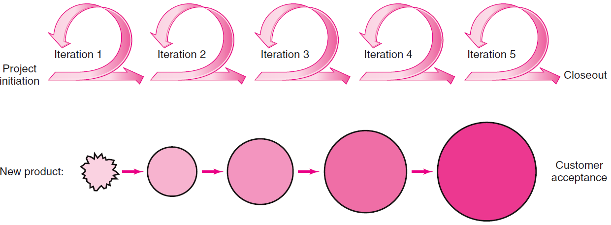
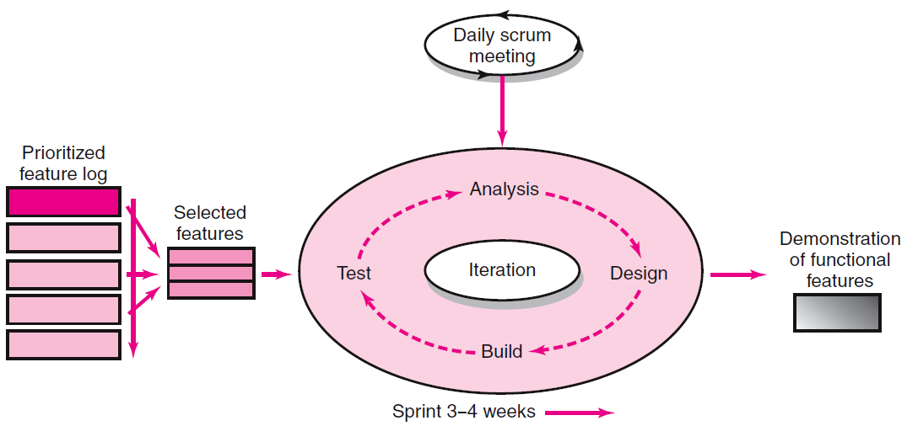

# Traditional Product Development vs. Agile
## Traditional product development Approach
- Concentrates on thorough, upfront planning of the entire project
- Requires a high degree of predictability to be effective.

## Agile Development
- Relies on incremental, iterative development cycles to complete less-predictable projects
- Is ideal for projects in which requirements need to be discovered and new technology tested
- Focuses on active collaboration between the project team and customer representatives

# Diagram of Agile / Iterative Incremental Development

# Key Roles in Scrum
## Product Owner
- Acts on behalf of customers to represent their interests
- Decides what will be developed and in what order

## Development Team
Is a team of five-nine people with cross-functional skill sets is responsible for developing the product

## Scrum Master (aka Project Manager)
Facilitates scrum process and resolves impediments at the team and organization level by acting as a buffer between the team and outside interference

# Scrum Diagram

# Advantages of Agile Development
- Continuous integration, verification, and validation of the evolving product
- Frequent demonstration of progress to increase the likelihood that the end product will satisfy customer needs
- Early detection of defects and problems

# Limitations and Concerns of Scrum
- Top management’s need for budget, scope at beginning may not be satisfied
- Based on principle of self-organization which may be incompatible with corporate cultures
- Scrum appears to work best on small projects that require only five-nine dedicated team members to complete the work
- Requires active customer involvement and cooperation
