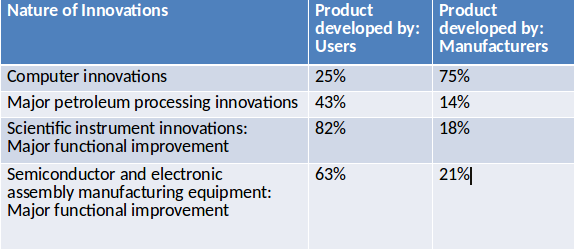
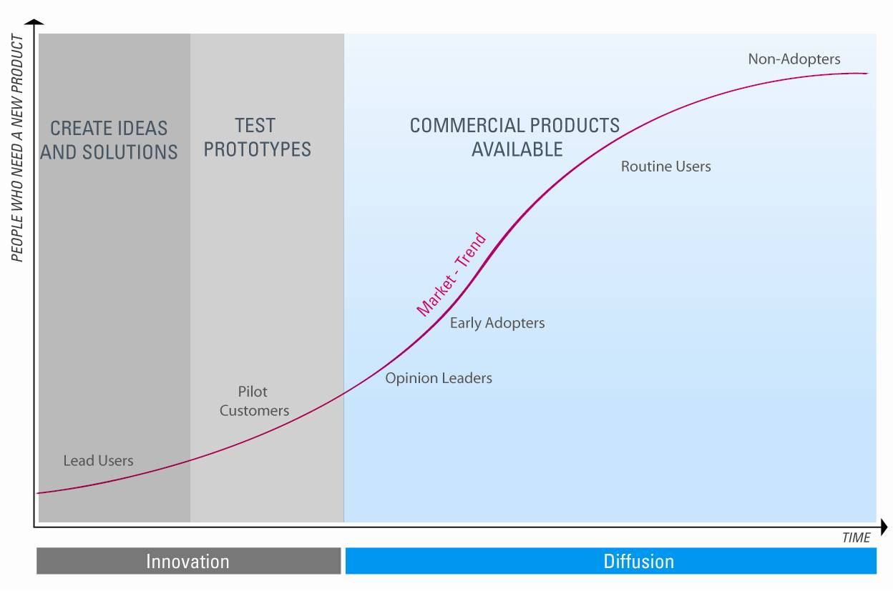

# Lead Users
Lead users are defined as members of a user population having two distinguishing characteristics:
- They are at the leading edge of an important market trend(s), and they are experiencing needs that will later be experienced by many users in that market.
- They anticipate relatively high benefits from obtaining a solution to their needs.

# Example: Lead User Innovation
- Innovations for windsurf board are often contributed by windsurfers (users). 
- The idea for protein-based hair conditioners came from inventive women in the early 1950s who rinsed their hair with home made conditioners containing egg or beer
- Accidental discovery of how users were using speakers led Bose to incorporate features in their new products
- 3M studied doctors in the Bosnian war (lead users) to get ideas for surgical 
products to prevent post-op infections

# Types of Lead Users
## Type 1
Lead users in the __target__ application market
### Example
Consider a manufacturer of X-Ray equipment who wants to identify concepts for new products

__Example of Lead User__: Medical radiologists working on applications in medical imaging that are very demanding with respect to images of high resolution and pattern recognition.

Consider a manufacturer of audio equipment who is trying to identify concepts for New products

__Example of Lead User__: Audiophiles, bands, music stores

## Type 2
Lead users of similar applications in __analogous__ markets
### Example
Consider a manufacturer of X-Ray equipment who wants to identify concepts for new products in the medical imaging industry

__Example of Lead User__: X-ray equipment manufacturers for the semiconductor industry (in the semiconductor industry X-ray equipment is used to find defects in semiconductors).

Consider an automobile manufacturer looking at innovations in braking

__Example of Lead User__: Engineers who develop braking for  the aircraft industry.
This resulted in Anti-lock Braking System (ABS) for cars

# Role of Users in Product Development

# The Lead User Curve

Lead users have needs that are well ahead of the trends; over time, more and more people feel the same needs.

# Classic Role of Users
- Passive, silent
- Have to choose from existing offers
- Behavior is observed to identify future needs and trends
- Are not asked for solutions of their problems

# New Understanding of the Role of Users
- Active, creative, collaborative
- Share their needs and contribute their ideas
- Participate in the development of products
- Become active co-developers in the innovation process

# Benefits of lead user innovation
- Access to richer & more reliable information on emerging customer needs than available thorough traditional market research
- Development of better product & service concepts: Lead uses have already developed some prototype product
- Acceleration of the product & service development process, In some cases product development is twice as fast as traditional ways of development:
    + Greater collaboration
    + Concepts require less development work

# Challenges of lead user innovation
- Difficulties in assessing lead-users participation in a team-based effort. This can prove problematic in assessing royalties or promotions
- High level of commitment needed from the company carrying out lead user innovation (e.g. in terms of the number of people involved needed to work with lead users)
