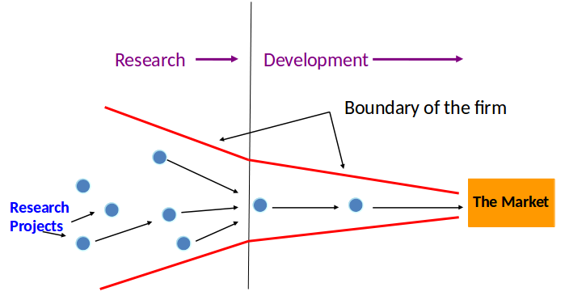
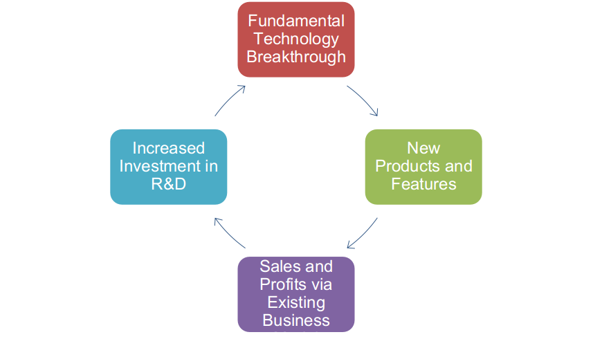
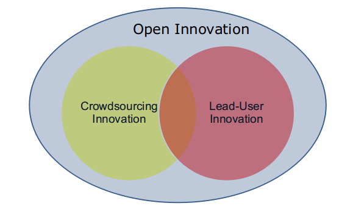

# Closed Innovation Model

# Closed Innovation Cycle

Companies generate their own ideas, then develop them, build them,
market them, & support them. Control based view.

# Open Innovation Model
Ideas come from outside and ideas that are not being used by the company can also be licensed out. It may involve:
- Investments in external ventures
- External acquisitions
- Licensing external technology
- Spin-off
- Licensing internal technology to others
- Collaboration with research partners

## Case Example: P&G
The huge success with Crest SpinBrush (an electric toothbrush), an idea which has quickly become the best-selling toothbrush in the US, did not come from P&G labs but from entrepreneurs in Cleveland.

__Corporate policy__: any ideas that originate in P&G’s labs will be offered to outside companies –even direct competitors-if an internal business does not use the idea within three years; P&G wants to increase outside ideas from 10% to 50% within the next 5 years.

# Case Example: Intel
2001 opened “lablets” –small-sized research facilities adjacent to  top university research centers. Intel assigns internal employees to interact directly with students they fund, as well as the student’s professors. Frequently Intel hires these students. Intel also gets access to promising new technologies.

# Case Example: Merck
Every month a group of scientists in different areas of disease research gather to evaluate the latest breakthroughs – not coming from Merck's own labs (journals, conference reports, patent literature, visits to other labs)

Merck had invested $5 million to seal an exclusive license and a multi year research collaboration with Amrad, today worth $112 million

# Case Example: Innocentive
Innocentive has signed up 30,000 scientists worldwide and pays bounties of up to $100,000 for solutions to the problems (until now $500,000) which paid off for the companies very well so far; e.g. a simpler manufacturing process for a compound was invented by an recently retired chemical engineer)

# Relationship Between Crowsourcing & Lead-User Innovation

# Descriptions
- __Open Innovation__: any kind of innovation that comes from outside the boundary of the company or goes outside from inside
E.g. licensing in, licensing out, buying start-ups, investing in start-ups, R&D collaboration
- __Lead-user innovation__: innovation that comes  from ‘lead-users’. Company works in collaboration with the lead users
- __Crowdsourcing__: innovation that comes from the ‘crowd’ (individuals/teams) that work on specific problems broadcast by the firm

