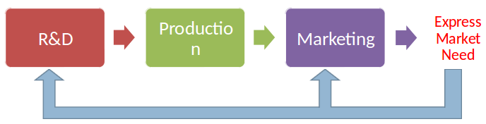
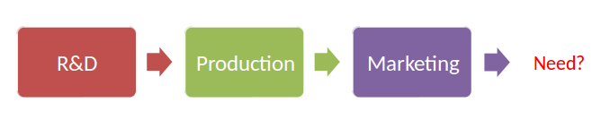

# Sample Case: HUL

One of India's largest fast moving consumer goods companies and is owned by the European company Unilever, which owns a 52% majority stake. Hindustan Unilever's distribution covers over 1 million retail outlets across India directly and its products are available in over 10 million outlets in the country

## Problem of HUL
Decade of under-performance: HUL has been under-performing both FMCG index and Sensex

## Finding Innovative Ideas: Project Bushfire
- Was launched by CEO to connect with customers / consumers.
- Every HUL employee (15,000) went out and met consumers and customers.
- They were given sheets of paper on which they were to asked to record their responses to the following questions:
    - What did I see that confirmed what I already know?
    - What did I see that was in conflict with what I thought I know?
    - What did I see that was totally unexpected or surprising?
    - What should HUL start doing?
    - What should HUL stop doing?   
    - What should HUL do more of?

## Benefit: Example
An employee found that because of lack of storage space many mom and pop store
preferred tetrapaks that could be hung on ceiling, leading to a re-design of 
tetrapaks  that could be easily hung.

## Impact of Project Bushfire
HUL features in Forbes World's Most Innovative Companies List.

# Market-Pull Innovation

## Examples
- ATM
- Budget Airlines
- On-line shopping
- Airbags in car

## Challenges
- Listening to customers all the time will lead to failure . Remember __disruptive innovations__ !
- Customers may not be able to imagine what they need.
- Bad suggestions from the market may lead to catastrophy

# Technology-Push Innovation

Create a market because no market need yet exists for the technology 
or find an existing market that has a need that the technology can solve. Not initiated by existing market need.

# Example
- iPad
- Telephone
- X-Ray Equipment
- Privacy filter
- Nintendo Wii

# Challenges
- Huge risk-taking. Assumption that market will like it
- You do not know what you are targeting
- Waste of resources if it fails the time it was developed

# Market Research
Market research involves the collection and analysis of information about customer needs, preferences for products, and purchasing decisions.

It consists of 4 parts:
- Ethnography
- Lead User Method
- Focus Groups
- Survey Research

## Ethnography
Market research technique that involves observing consumers
### Example

- Ethnographers from Xerox observed people in office settings who people were
struggling with making photocopies. This provided them with ideas to improve 
products
- Real-people-real-data (RPRD) program: RPRD grew into a longitudinal field study of Windows XP, where Microsoft team members 
visited periodically with 40 U.S. families living in their homes in order to generate distinctive feedback across hardware and software products. Microsoft is one of the largest employers of ethnographers.
- Nielsens uses technology to observe people

## Lead User Method
Lead users face needs much before the rest of the market
### Example
- Accidental discovery of how users were using speakers led Bose to incorporate features in their new products
- Participants in the workshop succeeded in developing an advanced
concept for an “Olympic snack” which specified what the snack food
should contain, as well as how it should be formulated and packaged.

## Focus Groups
Sessions in which eight to twelve people come together to discuss their needs
or preferences for new products or services.
### Purpose of Focus Groups
To get initial feedback on a product/innovation:
- A prototype may be shown to the focus group along with a set of questions they are to discuss
- The feedback received could be used to make further improvement
- If the feedback is very negative, maybe even decide to cancel the whole project

### Example
Microsoft focus group on two new smartphones
reveals problems, leading to Microsoft cancelling
the phones

## Pros
- High response rates
- Reduce non-response bias

## Cons
- Relatively expensive
- Hard to control direction of discussion
- Data is rarely independent of the views of other focus group members.
- May not be representative of larger population

## Survey Research
Survey research asks respondents questions about their needs and preferences.

Accuracy depends on:
- Develop questions that people are willing to answer and phrase them in a way that is clear to the respondents
- Gather information from a large enough number of people to differentiate statistically between the answers of the different respondents
- Identify a proper sampling frame, or targeted group of respondents, that represents the population about which you seek to gather information 

