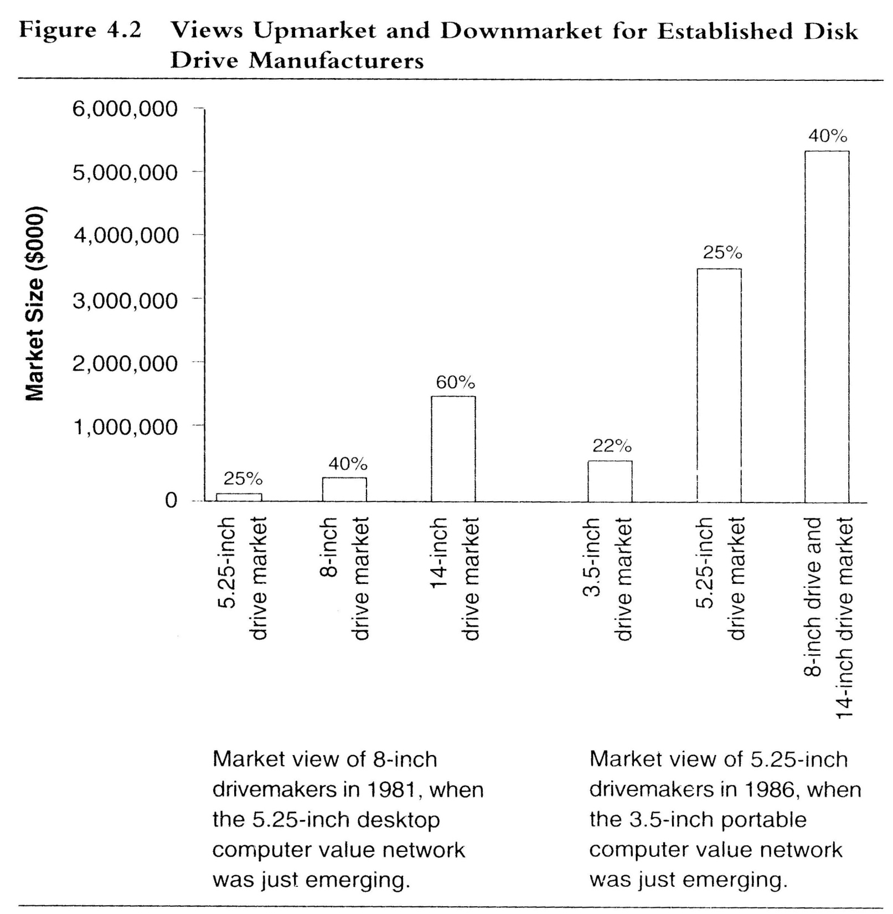

# Theory of Resource Dependence
Money flows in the direction of the mainstream customers because listening to mainstream customers is what has made the firm successful.

According to the theory of resource dependence, 
managers are just following customer research
(what customers say).

## Example
__Kodak__ continued listened to their mainstream market (primarily professional
photographers) and ignored digital photography

__Blockbuster__ continued listening to their mainstream market that loved the convenience of browsing and renting.

8 inch DD manufacturers decided to go up-market because their customers provided that feedback.

# Resource Process Value Framework
## Analyzing the failure of DEC
Why was Digital Equipment Corporation (DEC), 
a company successful at making minicomputers 
such a failure with Microcomputers (PC)?

We then analyze the R-P-V of DEC:
### Resources
- Intellectual Capital
- People
- Cash
- Brand name

In terms of resources, DEC had everything it needed to be successful in PC market

### Process
- 3 year design cycle for minicomputer
- 1 year design cycle for microcomputer

The processes for manufacturing the two products were different

### Value
- Minicomputer: 35 - 40% gross margins
- Microcomputer: 20% gross margins

No incentive to work on a product that gave lower margins since the company was used to higher margins.

### Conclusion
- Resource: Digital had the necessary resources (GOOD)
- Processes: Processes needed to be different (BAD)
- Values: DEC used to higher margins (BAD)

## Explaining the RPV Framework
### Resource
- People
- Cash
- Technology
- Brand
### Process
- Activities involved in converting inputs to outputs
- Manufacturing process
- Product design
- Marketing
### Value
- Standards used to prioritize between projects (e.g. gross margin)
- Culture of a company

## Takeaway
Analyzing why established companies have a problem with disruptive innovations,
the Resource Process Value Framework suggests that established companies values
and processes may not be suited for disruptive innovations

# Responding to Disruptive Innovations
## Making Internal Change
Example: Micropolis

Manufacturer of 8 inch DD that left its core market to manufacture
5.25 inch DD. Making internal change is hard because changing the processes and values of a company is hard.

## Setting up Independent Subsidiary
- Quantum creates independent subsidiary for 3.5 DD
- IBM creates independent subsidiary for PC
- HP created independent subsidiary for Inkjet printers.

## Acquiring the Company Developing Disruptive Innovation
Companies can also acquire companies developing disruptive innovations.
Apple believed that Siri’s technology (no-touch interface) could be possibly 
disruptive to their touch based interface. Example:
- Apple acquires Siri
- IBM acquires ROLM