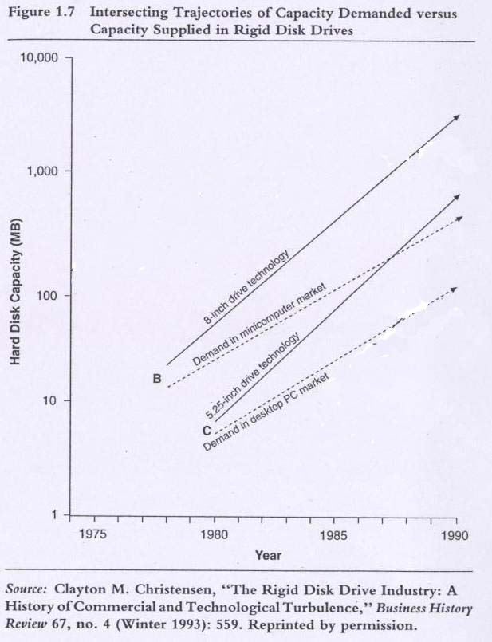

# Introduction
The Hard disk drive (HDD) is the ‘fruit fly’ of the technology industry because there is a lot of data about the HDD. The industry is an ideal start for studying the technology industry. We will first discuss disruptive innovations in the context of HDD industry and then generalize from there.

Motivation question: __Why was the failure rate in the disk drive industry so high?__

# Technology Mudslide Hypothesis
The idea that technology was moving so fast that companies could not keep up

## Evidence
- Capacity: goes up 35% / year
- Size: goes down 35% / year

Rate of change of technology was very fast in the hard disk drive industry.

## Contradiction
However, companies did well with sustaining technologies.

This theory is therefore invalid.

# So Why did the firms fail?

The 8 inch DD had already been used in the market for a few years before the 5.25 DD came out in the market.

In three crucial attributes the 8 inch DD was superior to the 5.25 inch DD.

All 8 inch DD manufacturers had access to 5.25 DD technology since it was relatively simple.

The 8 inch DD was primarily used in Minicomputers.

8 inch DD manufactures tried selling their 5.25 technology to their customers --> got rejected and cancelled further the development of 5.25 inch DD.

Seagate introduces 5.25 inch DD in Microcomputer Market and Microcomputer manufacturers love it because of:
- Small physical size
- Low unit cost
- Low Weight
Microcomputer market targets: __INDIVIDUALS__

Key takeaway (from that fancy graph):
Although the 8 inch drive technology is far superior than 5.25, the 5.25 eventually caught up to the demand of minicomputer market. As a consequence, Minicomputer markets shifted their attention to 5.25 DD because it has lower cost + footprint compared to 8 inch drive. 

# Characteristics of Disruptive Technologies:
- Initially cannot be used in mainstream market since its inferior
- Finds application in emerging market
- Generally provide low margin for established company (low profit)
- Mainstream customers do not value them (initially)

# Sustaining vs Disruptive Technologies
## Sustaning Technologies:
- Improve products along dimensions mainstream customer want
- Established firms led development
- Incremental or radical

## Disruptive Technologies:
- Mainstream customers ignore them, since initially they provide worse performance
- Emerging markets may value them
- Entrant firms led development
- Low margins

